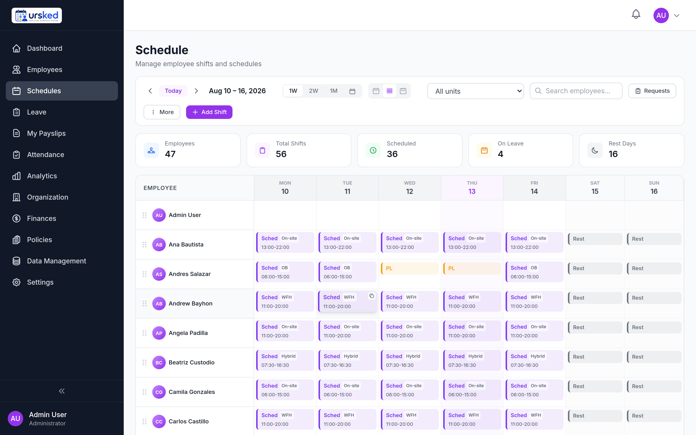
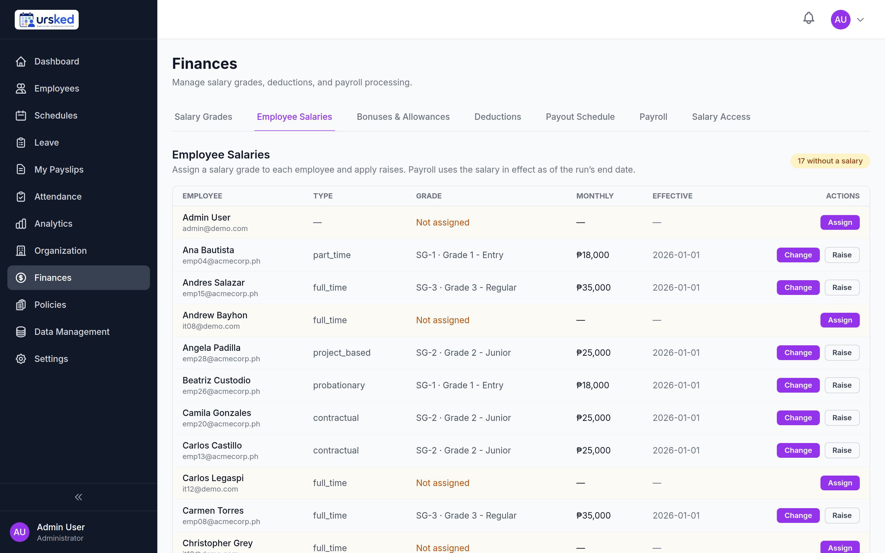
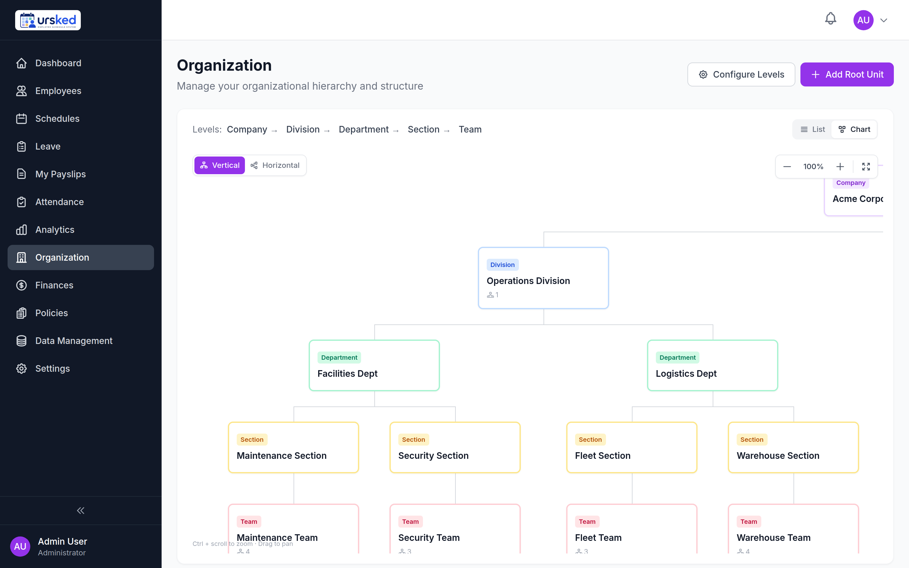
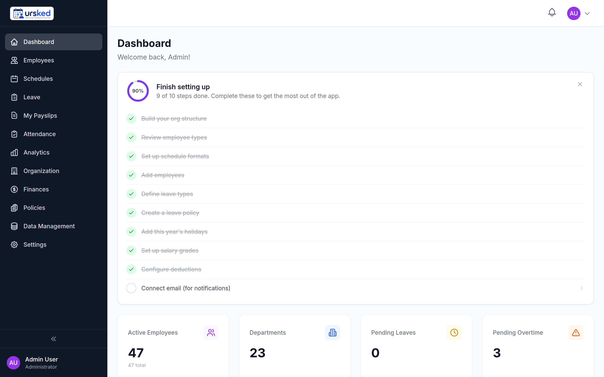

<div align="center">


### The employee roster, all the way to the payslip — self-hosted.

**ursked** is a workforce-management platform for scheduling, leave, attendance
and payroll. This is the **Community Edition**: a single-organization build you
run on your own server, with your data on your own infrastructure.

[Quickstart](#quickstart) · [What it does](#what-it-does) · [Screenshots](#screenshots) · [Security](#security--access-control) · [License](#license)



</div>

---

> **Source available, not open source.** ursked is licensed under the
> [Elastic License 2.0](LICENSE). You may run and modify it for your own
> organization, but you may **not** offer it to third parties as a hosted or
> managed service. See [NOTICE](NOTICE) and [TRADEMARK.md](TRADEMARK.md).

## What it does

ursked replaces the spreadsheet-and-email workflow most teams use to run their
staff. It covers the whole cycle in one place, with role-aware access so people
only see and do what they should.

### Scheduling
- Weekly roster grid with multiple shift patterns and work arrangements
  (on-site, WFH, hybrid).
- Draft rosters, then publish when they're ready — nothing is visible to staff
  until you say so.
- One-click week duplication, per-employee display timezones, and guardrails
  against over-scheduling.
- Shift change requests and swaps that route through approval.

### Leave management
- Configurable leave types with balances and accrual.
- Multi-level, priority-based approval chains — route requests to the right
  approvers, with fallbacks and exclusions.
- Live balance tracking so requesters and approvers see what's available.

### Attendance & overtime
- Track clock times, tardiness and overtime against policy rules.
- Policy-driven exceptions are flagged automatically.
- Night-differential and holiday handling built in.

### Payroll & compensation
- Salary grades with effective-dated raises.
- Bonuses, allowances and deductions as an auditable ledger.
- Run payroll per period; figures are denominated in your organization's master
  currency.
- Sensitive salary data sits behind an approval-based enrollment gate.

### Organization
- Model your company down to Company → Division → Department → Section → Team —
  the hierarchy is configurable to any depth.
- Assign heads and deputies; drive schedule visibility and approval routing from
  the tree.
- List view and an interactive org chart.

### Analytics
- Monthly trends for overtime, leave and attendance to help you staff smarter.

## Screenshots

<table>
  <tr>
    <td width="50%"><b>Weekly schedule</b><br>
      </td>
    <td width="50%"><b>Payroll &amp; salaries</b><br>
      </td>
  </tr>
  <tr>
    <td width="50%"><b>Organization chart</b><br>
      </td>
    <td width="50%"><b>Dashboard</b><br>
      </td>
  </tr>
</table>

## How it's built

| Layer | Stack |
|---|---|
| Backend | FastAPI · SQLAlchemy (async) · Alembic migrations |
| Frontend | Next.js 14 (App Router) · Tailwind CSS |
| Data | PostgreSQL · Redis |
| Delivery | Docker images for `backend` and `frontend`, orchestrated by Docker Compose |

The browser only ever talks to the frontend origin; it proxies `/api/*` to the
backend internally, so auth cookies stay first-party and there is no CORS to
configure for the default deployment.

## Requirements

- A Linux host with **Docker** and the **Docker Compose plugin**.
- **2 GB RAM** minimum (the compose memory limits total 2 GB; a 1 GB VPS will
  not work). 4 GB recommended if you run other services on the same host.
- Optionally, a reverse proxy (Caddy, nginx, Traefik) to terminate HTTPS in
  front of the app.

## Quickstart

```bash
# 1. Get the code
git clone https://github.com/ursked/ursked.git
cd ursked

# 2. Configure
cp .env.example .env

# Generate the required secrets and paste them into .env
python3 -c "import secrets; print('JWT_SECRET_KEY=' + secrets.token_urlsafe(64))"
python3 -c "import secrets; print('POSTGRES_PASSWORD=' + secrets.token_urlsafe(24))"
python3 -c "import secrets; print('REDIS_PASSWORD=' + secrets.token_urlsafe(24))"

# Edit .env: set the secrets above, and your ORG_NAME / ADMIN_EMAIL.
# Leave ADMIN_PASSWORD blank to have one generated for you.
nano .env

# 3. Start
docker compose up -d
```

On first boot the backend runs the database migrations and then creates your
**one organization and one administrator**.

### Get your admin password

If you left `ADMIN_PASSWORD` blank, it was generated and printed **once** in the
backend logs:

```bash
docker compose logs backend | grep -A6 "first-run setup complete"
```

You will see a banner with your organization name, the admin email, and the
generated password. Copy it now.

### Lost your password?

If the generated password is lost, reset it with the included script (the stack
must be running):

```bash
./reset-admin-password.sh 'MyN3wP@ss!'
```

The script hashes the new password inside the backend container (same bcrypt
parameters the app uses), updates the admin user, and forces a password change
on next sign-in. If the stack is not running, the manual psql fallback is:

```bash
# Generate a bcrypt hash (replace YOUR_NEW_PASSWORD)
docker compose run --rm -T backend python -c \
  "import bcrypt; print(bcrypt.hashpw(b'YOUR_NEW_PASSWORD', bcrypt.gensalt()).decode())"

# Paste the hash into the update. This targets the OLDEST user, which on a fresh
# install is the seeded administrator — no email needed.
docker compose exec -T db psql -U "$POSTGRES_USER" -d "$POSTGRES_DB" -c \
  "UPDATE users SET password_hash='<paste-hash-here>', must_change_password=true
   WHERE id = (SELECT id FROM users ORDER BY id LIMIT 1);"
```

### Sign in

By default the app serves on all interfaces on port **3000**, so open
`http://<this-host>:3000` on your LAN, `http://127.0.0.1:3000` locally, or your
proxied domain. Sign in with the admin email and that password. **You will be
required to change the password on first sign-in.**

> The host port is configurable — set `APP_PORT` in `.env` (default `3000`). If
> port 3000 is already taken on your host, change it there.

## Adding your team

You sign in as the single administrator created on first boot. To add everyone
else, go to **Employees → Add Employee**. Under **Account Setup** you choose one
of two ways to set their credentials:

1. **Set Password Manually (works with no email).** Type an initial password; the
   account is usable immediately. Hand the password to the person out-of-band
   (chat, in person). This is the simplest path for a first trial and needs no
   mail server.

2. **Send Invite Email (requires SMTP).** The person receives an activation link
   to set their own password. This only works if email is configured — see below.

> **Heads-up:** invites, password resets, and security alerts all go out by
> email. **If you have not configured SMTP, those emails are silently dropped** —
> an invited user will never get their activation link. If email isn't set up
> yet, use option 1 above. On startup the backend logs a clear warning when SMTP
> is unconfigured (`docker compose logs backend`).

### Configuring email (SMTP)

Either set the `SMTP_*` variables in `.env` before first boot (they seed the mail
config once), **or** configure it in-app afterwards as the admin under
**Settings → Email**, which takes precedence. Use *Send test email* there to
confirm it works before relying on invites.

### Notifications

ursked has two notification channels:

- **In-app** — schedule changes, leave decisions, and other events appear in the
  notification bell inside the app. This works with no configuration and is
  always on (controlled by **Settings → Notifications** in the admin panel).
- **Email** — invitations, password resets, account-lockout alerts, and leave
  decision confirmations are sent by email. **These require a working SMTP
  configuration** (see above). Without it, email notifications are silently
  dropped — no error is shown, and the recipient simply never receives them.

There is no push notification (browser push, mobile) in the Community Edition.
If you rely on email for any workflow, verify SMTP is configured and working
before onboarding your team.

## Running behind HTTPS

For production, keep `ENVIRONMENT=production` and `COOKIE_SECURE=true`, and put a
TLS-terminating reverse proxy in front of the frontend's published port
(`APP_PORT`, default `3000`). The browser only ever talks to the frontend origin;
it proxies `/api/*` to the backend internally, so no CORS setup is needed.

### Plain-HTTP trial (no proxy)

Secure cookies require HTTPS, so production refuses to start without them. To try
the app over plain HTTP on a **trusted network** (localhost or a LAN IP, no
reverse proxy), set both of these in `.env`:

```
COOKIE_SECURE=false
ALLOW_INSECURE_TRANSPORT=true
```

`ENVIRONMENT` stays `production`. The opt-in downgrades only the two transport
checks (Secure cookies and `http://` CORS origins) to loud startup warnings;
`DEBUG` and wildcard CORS remain hard-blocked. **Never enable
`ALLOW_INSECURE_TRANSPORT` on anything reachable from the internet** — put TLS in
front and leave it `false`.

## Security & access control

- **Role-based access control** — a module-and-action permission matrix across
  seven built-in roles governs what each user can see and do.
- **Two-factor authentication** — TOTP, SMS, or email.
- **Salary access gating** — payroll figures are only visible to users
  explicitly enrolled through an approval flow.
- **Hardened startup** — the backend refuses to boot in production with a weak
  JWT secret, `DEBUG` on, wildcard CORS, or insecure cookies (see the trial
  opt-in above for the one deliberate, network-scoped exception).
- **CSRF protection** on state-changing requests, with security response headers
  applied globally.

## Updating

**Before upgrading, always back up your database:**

```bash
docker compose exec -T db pg_dump -U "$POSTGRES_USER" "$POSTGRES_DB" \
  > "backup-before-upgrade-$(date +%F).sql"
```

Then pull and rebuild:

```bash
git pull
docker compose build
docker compose up -d
```

Migrations run automatically on start. The seed step is skipped once your
organization exists, so your data is never touched.

### If a migration fails

The backend runs `alembic upgrade head` on every start. If a migration fails
partway (the backend logs will show the error), the database may be in a
partially-migrated state and the backend will crash-loop. To recover:

1. Check the error: `docker compose logs backend | tail -50`
2. Restore from your pre-upgrade backup:
   ```bash
   docker compose down
   docker volume rm "$(docker volume ls -q | grep postgres_data)"
   docker compose up -d
   docker compose exec -T db psql -U "$POSTGRES_USER" -d "$POSTGRES_DB" \
     < backup-before-upgrade-YYYY-MM-DD.sql
   ```
3. Stay on the previous version (`git checkout v0.1.2`) until the issue is
   resolved, and open an issue on GitHub with the migration error.

## Common commands

```bash
docker compose ps                 # service status
docker compose logs -f backend    # follow API logs
docker compose down               # stop (data is kept in named volumes)
```

## Backups

Your data lives in the `postgres_data` Docker volume. Back it up with a standard
`pg_dump` (run these from the directory holding your `.env`, so `$POSTGRES_USER`
and `$POSTGRES_DB` are set):

```bash
# Back up to a timestamped file
docker compose exec -T db pg_dump -U "$POSTGRES_USER" "$POSTGRES_DB" \
  > "backup-$(date +%F).sql"
```

### Restoring

Restore into a running stack. This **overwrites** existing data, so only do it on
a fresh install or when you intend to replace what's there:

```bash
# Pipe a dump back in
docker compose exec -T db psql -U "$POSTGRES_USER" -d "$POSTGRES_DB" < backup.sql
```

For a clean restore, stop the app, remove only the database volume, then bring it
back up and load the dump:

```bash
docker compose down                     # keeps volumes
docker volume rm ursked_postgres_data   # wipe DB only (name may be prefixed by your folder)
docker compose up -d                    # migrations recreate the schema
docker compose exec -T db psql -U "$POSTGRES_USER" -d "$POSTGRES_DB" < backup.sql
```

## Troubleshooting

The app runs with `DEBUG=false`, so browser-side errors are intentionally generic
(`Internal server error`) — the real detail is in the backend log. When something
doesn't work, that log is the first place to look:

```bash
docker compose logs -f backend    # follow the API log live
docker compose ps                 # are all services healthy?
```

Common first-boot issues: a missing required secret (`JWT_SECRET_KEY`,
`POSTGRES_PASSWORD`, `REDIS_PASSWORD`) stops the stack with a clear message; over
plain HTTP without `ALLOW_INSECURE_TRANSPORT=true` the backend refuses to start on
purpose (see *Plain-HTTP trial* above).

## License

[Elastic License 2.0](LICENSE) · Copyright (c) 2026 Jan Roldan Hernandez.
"ursked" is a trademark of Jan Roldan Hernandez; forks must rename
(see [TRADEMARK.md](TRADEMARK.md)).
